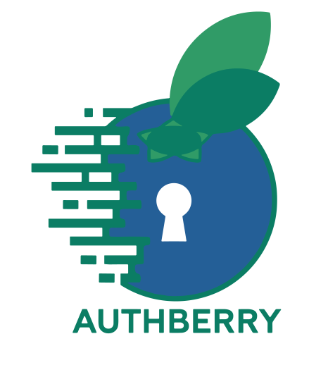
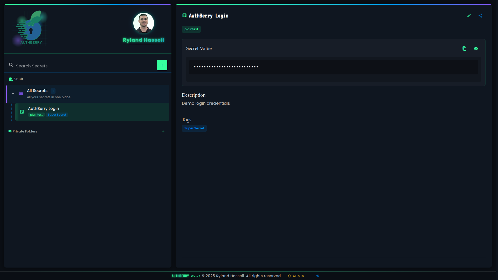

# AuthBerry - Secrets Manager

<div align="center">
  
  <br/>
  <i>A secure, hardware-backed secrets manager for your home network</i>
</div>

## 📑 Table of Contents

- [Introduction](#-introduction)
- [Screenshots](#-screenshots)
- [Core Architecture](#️-core-architecture)
- [Security Model](#-security-model)
- [Installation](#-installation)
  - [Hardware Requirements](#hardware-requirements)
  - [Software Prerequisites](#software-prerequisites)
  - [Installation Steps](#installation-steps)
  - [Configuration Options](#configuration-options)
- [Usage Guide](#-usage-guide)
- [Technical Details](#-technical-details)
  - [Container Architecture](#container-architecture)
  - [Database Schema](#database-schema)
  - [TPM Integration](#tpm-integration)
- [Troubleshooting](#-troubleshooting)
- [License](#-license)

## 🔐 Introduction

AuthBerry is a secure, hardware-backed secrets manager designed to run on a Raspberry Pi with TPM integration or any Linux system with TPM 2.0 capabilities. It provides a user-friendly interface for storing, organizing, and sharing sensitive information within your local network.

Unlike cloud-based alternatives, AuthBerry keeps your sensitive data under your physical control while offering modern features like end-to-end encryption, granular access controls, and a responsive web interface.

### Key Features

- **Strong Encryption**: All secrets are encrypted at rest and in transit
- **Hardware Security**: Leverages TPM 2.0 for hardware-backed key protection
- **Access Controls**: Share secrets with granular permissions
- **Secret Types**: Support for plaintext and image secrets
- **Organizational Tools**: Folders and tags for organizing secrets
- **Real-time Updates**: WebSocket-based real-time notification system

## 📸 AuthBerry Dashboard

<div align="center">



*AuthBerry's intuitive dashboard interface showcasing secrets management with modern Vue.js design*

</div>

## 🏗️ Core Architecture

AuthBerry employs a containerized three-tier architecture with strict security boundaries:

### Component Diagram

<div align="center">
  
</div>

1. **Frontend Container (auth_berry_vue)**
   - Vue.js 3.5 with Vuetify 3.8 UI framework
   - Node.js serving built static assets in production
   - Custom E2E encryption over WebSockets using ECDH key exchange
   - Single Page Application (SPA) design for responsive user experience

2. **Backend Container (auth_berry_flask)**
   - Flask 3.1.0 with custom WebSocket encryption handlers
   - Handles authentication, authorization, and application logic over encrypted WebSockets
   - Integrates with TPM for secure key operations
   - ECDH P-256 key exchange with AES-GCM encryption

3. **Database Container (auth_berry_mariadb)**
   - MariaDB database with TPM-sealed credentials
   - Stores encrypted secrets and user information
   - Custom initialization scripts for secure setup

### Data Flow

1. All frontend-backend communication occurs over encrypted WebSockets using custom E2E encryption
2. ECDH P-256 key exchange establishes shared secrets for AES-GCM encryption
3. Authentication and all sensitive operations happen over the encrypted WebSocket channel
4. Database credentials are TPM-sealed and only decrypted in memory during runtime
5. File uploads are sanitized, encrypted, and stored securely with strict access controls

## 🔑 Security Model

AuthBerry implements defense-in-depth with multiple layers of security:

### Authentication and Authorization

- **Argon2 Password Hashing**: Memory-hard hashing algorithm resistant to GPU/ASIC attacks
- **JWT-based Sessions**: Short-lived tokens with automatic renewal for authenticated sessions
- **Role-Based Access Control**: Granular permissions for individual secrets and folders
- **Rate Limiting**: Protection against brute force and DoS attacks

### Key Management

1. **TPM-Sealed Master Keys**:
   - Application secrets (DB credentials, encryption keys) are sealed to the TPM
   - Secrets can only be unsealed by the specific TPM they were sealed with
   - Secrets are never exposed on disk in plaintext form

2. **Encryption Hierarchy**:
   - Master Key: TPM-protected key used to protect all other keys
   - Database Encryption Key: Protects user data in the database
   - User Keys: Derived keys for user-specific encryption operations
   - Session Keys: Short-lived keys for securing WebSocket communications

### Data Protection

1. **At Rest**:
   - Database records encrypted with Fernet symmetric encryption
   - Image files stored as TPM-sealed blobs
   - Configuration files containing sensitive data are TPM-sealed

2. **In Transit**:
   - All client-server communication secured with custom end-to-end encryption over WebSockets
   - ECDH P-256 key exchange establishes shared secrets for AES-GCM encryption
   - No HTTPS dependency - runs securely on local networks

3. **In Memory**:
   - Database initialization implements secure cleanup of sensitive variables
   - TPM-sealed credentials are only decrypted in memory during runtime
   - Sensitive data cleared from WebSocket sessions on disconnect

## 🚀 Installation

AuthBerry is designed to be deployed on a dedicated device (preferably a Raspberry Pi or small form-factor PC) with TPM 2.0 support.

### Hardware Requirements

- **Recommended Setup**:
  - Raspberry Pi 5 (8GB+ RAM) or any x86_64 system with 2GB+ RAM
  - TPM 2.0 module (such as TPM9670 for Raspberry Pi)
  - 16GB+ storage (SSD recommended for better performance)
  - Ethernet connection (for security and reliability)

- **Minimum Requirements**:
  - Any Linux-compatible system with TPM 2.0 support
  - 1GB RAM
  - 8GB storage

### Software Prerequisites

- Linux-based OS (tested on Raspberry Pi OS, Ubuntu 22.04+)
- TPM 2.0 support configured in the OS
- Docker Engine 24.0+ and Docker Compose plugin
- tpm2-tools package installed

### Installation Steps

1. **Clone the Repository**:
   ```bash
   git clone https://github.com/yourusername/AuthBerry.git
   cd AuthBerry_Backup
   ```

2. **Run the Setup Script**:
   ```bash
   # For development environment
   sudo ./initial_setup.sh dev
   
   # For production environment
   sudo ./initial_setup.sh prod
   ```
   
   The setup script automatically:
   - Detects and configures TPM devices
   - Sets up Raspberry Pi TPM overlay if needed
   - Finds available ports and configures services
   - Installs all dependencies

3. **Verify Installation**:
   ```bash
   # Check services are running
   docker ps
   
   # View logs
   make logs
   ```

4. **Access the Web Interface**:
   - Open a browser and navigate to the port configured in your `.env` file
   - Development and production ports are automatically detected during setup

## 📖 Usage Guide

### First-Time Setup

1. **Create Admin Account**:
   - The first user to register becomes the system administrator
   - Admin can enable/disable user registration and manually create, lock, or delete users
   - Admin cannot access other users' credentials

2. **Create Folder Structure**:
   - Create folders to organize secrets
   - Set appropriate permissions for each folder

3. **Add Secrets**:
   - Create new secrets via the "+" button
   - Select secret type (plaintext or image)
   - Set appropriate access controls

### Managing Secrets

1. **Types of Secrets**:
   - **Text Secrets**: Passwords, API keys, notes
   - **Image Secrets**: Secure storage for PNG and JPG images

2. **Sharing and Permissions**:
   - **Private**: Only visible to the creator
   - **Shared**: Secret or folder-based sharing with specific users
   - **Folder Sharing**: Users with folder access can access contained secrets

3. **Permission Levels**:
   - **View**: Can see but not modify
   - **Use**: Can see and use (copy) but not modify
   - **Edit**: Can modify content but not permissions
   - **Manage**: Full control including permissions

### Administrative Functions

1. **User Management**:
   - Enable/disable user registration
   - Manually create, lock, or delete users
   - Assign roles and permissions

2. **System Maintenance**:
   - Database migrations with Flask-Migrate
   - Backup and restore data
   - Update application components

## 🔧 Technical Details

### Container Architecture

AuthBerry's container architecture is designed for security isolation and resource efficiency:

1. **MariaDB Container**:
   - Custom build with TPM integration
   - TPM-sealed credentials
   - Persistent volume for data storage
   - Healthchecks to ensure database availability

2. **Flask Container**:
   - Python 3.13 with gunicorn in production
   - Flask application with SQLAlchemy ORM and Flask-Migrate for database versioning
   - Access to TPM for unsealing secrets
   - File upload handling with secure storage
   - Alembic-based migration system for schema evolution

3. **Vue Container**:
   - Development: Node.js with hot-reloading
   - Production: Node.js serving static assets
   - Port 3000 exposed for web access

### Database Schema

The database is structured around these main entities:

1. **Users**: User accounts and authentication information
2. **Secrets**: Encrypted user secrets with metadata
3. **Folders**: Organizational structure for secrets
4. **Permissions**: Access control records

### TPM Integration

The TPM (Trusted Platform Module) is used for:

1. **Key Protection**:
   - TPM-sealed blobs cannot be decrypted on another device
   - Protection against offline attacks

2. **Hardware-Bound Encryption**:
   - TPM sealing ties encrypted data to the specific TPM chip
   - Provides hardware-level security assurance
   - Prevents unauthorized access even with physical device access

3. **Secret Generation**:
   - TPM's hardware random number generator used for key generation
   - Provides cryptographic quality entropy

The integration uses the `tpm2-pytss` library which provides a Python interface to the TPM 2.0 Software Stack (TSS). Key TPM operations include:

- **Primary Key Generation**: Creates a persistent RSA-2048 key sealed to the TPM
- **Secret Sealing**: Binds user data to specific TPM using KEYEDHASH objects
- **Secure Unsealing**: Retrieves secrets only when proper TPM authentication is provided
- **Hardware RNG**: Generates cryptographically secure random data for encryption keys

### API Architecture

AuthBerry uses a RESTful API architecture designed specifically for the Vue.js Single Page Application frontend. The API is not intended for external consumption and includes:

**Authentication Endpoints** (`/api/auth/`):
- User registration, login, logout, and session management
- JWT token refresh and profile management
- Admin functions and setup operations

**Secrets Management** (`/api/secrets/`):
- CRUD operations for text and file secrets
- Secure file upload and download with encryption
- Secret sharing and permission management

**Folder Organization** (`/api/folders/`):
- Hierarchical folder structure management
- Folder-based permissions and sharing
- Organizational tools for secret management

**User Management** (`/api/users/`):
- User profile and photo management
- Administrative user operations
- Permission and role assignment

All API endpoints require authentication and use the same custom E2E encryption over WebSockets for secure communication as the main application interface.

## 🔍 Troubleshooting

### TPM Issues

1. **TPM Device Not Found**:
   - Check if TPM is enabled in BIOS/UEFI
   - Verify device permissions:
     ```bash
     ls -l /dev/tpm*
     ls -l /dev/tpmrm*
     ```
   - Ensure the TPM module is loaded:
     ```bash
     lsmod | grep tpm
     ```

2. **TPM Permission Errors**:
   - Ensure the current user is in the `tss` group:
     ```bash
     sudo usermod -aG tss $(whoami)
     newgrp tss  # Apply group change without logout
     ```
   - Check if tpm2-tools is installed:
     ```bash
     tpm2_getcap -T device
     ```

3. **Raspberry Pi TPM Setup**:
   - The setup script automatically detects Raspberry Pi and configures TPM if needed
   - If manual configuration is required:
     - Ensure SPI is enabled in `raspi-config`
     - Add TPM overlay to `/boot/config.txt`: `dtoverlay=tpm-slb9670`
     - Reboot and verify: `ls -l /dev/tpmrm0`

### Container Issues

1. **Container Fails to Start**:
   - Check logs:
     ```bash
     docker logs auth_berry_flask
     docker logs auth_berry_mariadb
     ```
   - Verify volumes and mounts:
     ```bash
     docker volume ls
     docker volume inspect auth_berry_mariadb
     ```

2. **Database Initialization Fails**:
   - Check MariaDB logs:
     ```bash
     docker logs auth_berry_mariadb
     ```
   - Try manual initialization:
     ```bash
     make init-db
     ```

3. **Network Issues**:
   - Check Docker network:
     ```bash
     docker network ls
     docker network inspect auth_berry_network
     ```
   - Verify port bindings:
     ```bash
     docker port auth_berry_vue
     docker port auth_berry_flask
     ```

### Application Issues

1. **Login Problems**:
   - Check backend logs for authentication errors
   - Verify JWT token configuration
   - Check browser console for network errors

2. **Performance Issues**:
   - Monitor container resource usage:
     ```bash
     docker stats
     ```
   - Check database performance:
     ```bash
     docker exec -it auth_berry_mariadb mysql -u root -p -e "SHOW PROCESSLIST"
     ```

## 📄 License

AuthBerry is licensed under the MIT License. See the LICENSE file for details.

---

<div align="center">
  <p>
    <strong>AuthBerry</strong> - Secure your secrets, protect your privacy
  </p>
</div>
